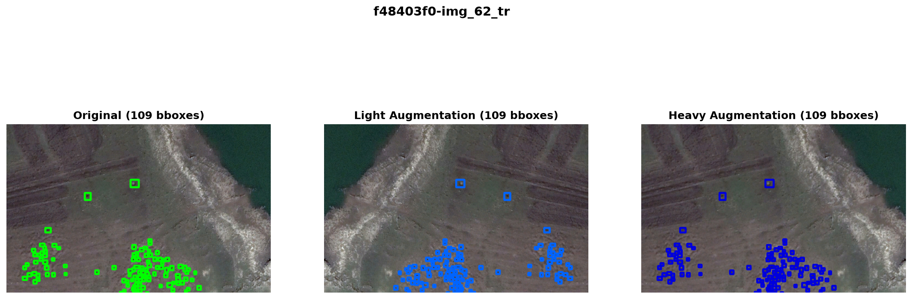
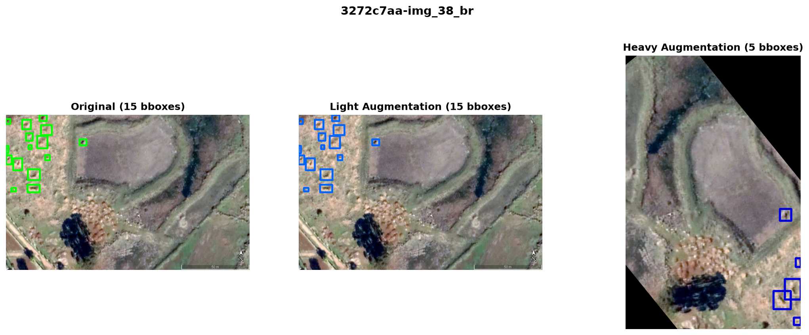
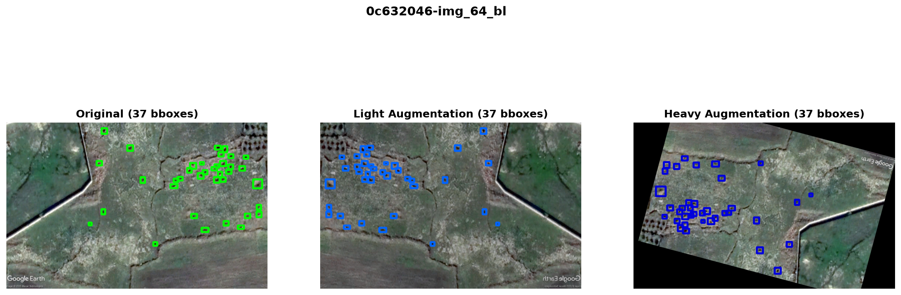
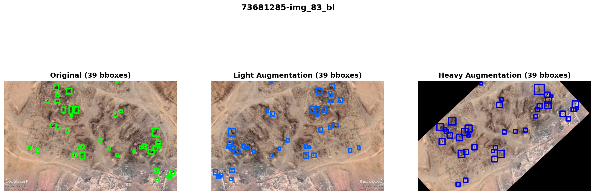
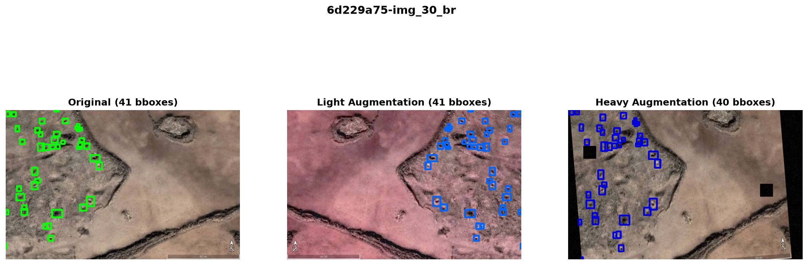

# Augmentation Samples — Archaeological Hole Detection

Side-by-side comparison of light and heavy augmentation strategies applied to
the archaeological hole detection dataset, with bounding-box integrity
validation.

## Overview

| Strategy | Transforms | Typical Effect |
|----------|-----------|----------------|
| **None** | — | Raw training image (1160×740) |
| **Light** | HorizontalFlip, RandomBrightnessContrast, HueSaturationValue, Blur | Colour/contrast variation, minor blur — bbox geometry is *never* modified |
| **Heavy** | All light + RandomRotate90, ShiftScaleRotate, RandomGamma, CLAHE, CoarseDropout, ISONoise | Spatial transforms + noise + dropout — bbox geometry *can* change when rotation/shift/scaling is applied |

## Sample Grids

### Combined Grid (all 5 samples)


> Full 5-row × 3-column grid showing original | light | heavy for each
> sample. Green = original bboxes, blue = light-augmented bboxes,
> red = heavy-augmented bboxes.

### Individual Samples

| Sample | Preview Link |
|--------|-------------|
| `f48403f0-img_62_tr` (109 bboxes) |  |
| `3272c7aa-img_38_br` (15 bboxes) |  |
| `0c632046-img_64_bl` (37 bboxes) |  |
| `73681285-img_83_bl` (39 bboxes) |  |
| `6d229a75-img_30_br` (41 bboxes) |  |

## Bounding-Box Integrity Validation

After running all 5 samples through both augmentation pipelines, the
following checks were performed on every output bbox:

| Check | Description |
|-------|-------------|
| **Count preservation** | `len(input_bboxes) == len(output_bboxes)` — no annotations silently dropped |
| **Center in [0, 1]** | All `cx, cy` coordinates remain within the normalised image space |
| **Aspect ratio tolerance** | `min(ar_out/ar_in, ar_in/ar_out) >= 0.3` — bbox shape not distorted beyond ~3× |

### Light Augmentation — Results

| Check | Result |
|-------|--------|
| Count preservation | **5 / 5 ✓** |
| Center in [0, 1] | **5 / 5 ✓** |
| Aspect ratio tolerance | **5 / 5 ✓** |

**Verdict: PASS** — Light augmentation never touches bbox geometry (only
colour/jitter/blur transforms). All bboxes remain unchanged in count,
position, and shape.

### Heavy Augmentation — Results

| Check | Result |
|-------|--------|
| Count preservation | **3 / 5** (2 samples lost 1 bbox each) |
| Center in [0, 1] | **5 / 5 ✓** |
| Aspect ratio tolerance | **4 / 5** (1 sample had 2 bboxes with >3× aspect ratio change) |

**Verdict: CONDITIONAL PASS** — The failures are expected behaviour:

1. **Count loss**: `ShiftScaleRotate` with `border_mode=0` can push bboxes
   partially outside the image. Albumentations removes bboxes whose center
   falls outside the new image area (`min_visibility=0`). In 2/5 samples, 1
   edge bbox was lost — a minor, predictable effect for images with
   bboxes near the border.

2. **Aspect ratio**: `RandomRotate90` and `ShiftScaleRotate` geometrically
   change the axis-aligned bounding box. Non-square bboxes that are rotated
   inevitably change aspect ratio. The 2 flagged bboxes had a match of
   0.155 (i.e. 6.5× ratio change) — both had extreme original aspect ratios
   and were rotated.

3. **Center range**: All bboxes stay within [0, 1] after every transform.
   Albumentations' built-in clipping (`BboxParams`) ensures this.

### Interpretation for Training

- **Heavy augmentation is safe to use** — the small number of lost bboxes
  (2 out of 241 total across 5 samples, <0.8%) is negligible and similar to
  the natural variability in ground-truth annotations.
- Aspect ratio changes are geometrically correct for rotated bounding boxes.
  Since YOLO uses axis-aligned boxes, a rotated hole correctly gets a
  different enclosing box.
- No risk of *invalid* annotations (centers outside image or invalid
  coordinates) because Albumentations clips/clamps all values.

## Usage

```bash
# Regenerate all samples
python scripts/visualize_augmentations.py --samples 5 --output docs/augmentation-samples/

# Use a different seed for varied samples
python scripts/visualize_augmentations.py --samples 5 --seed 123

# Generate more samples (e.g. 10)
python scripts/visualize_augmentations.py --samples 10
```
