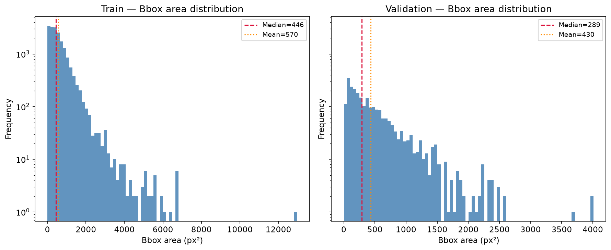
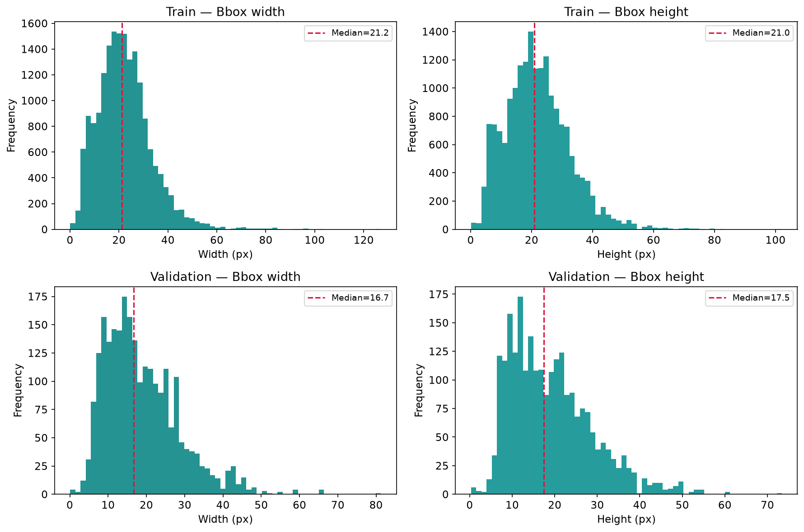
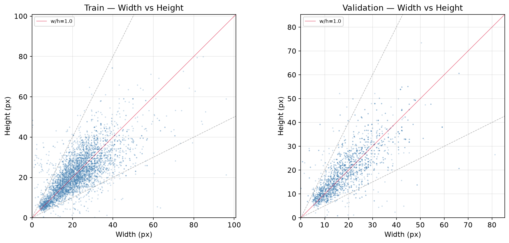
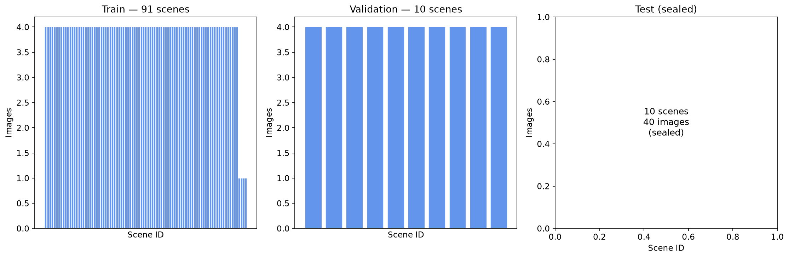
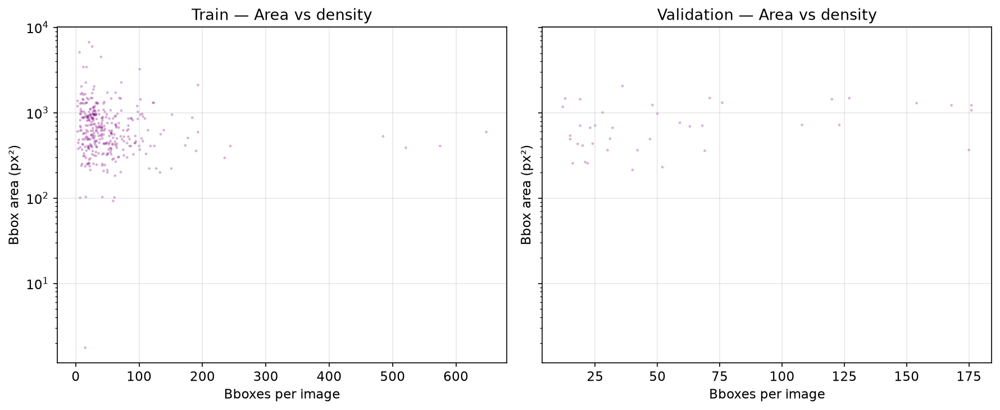

# Dataset Analysis Report — Archaeological Hole Detection

Automated analysis of the hole-detection dataset at `dataset/`. All images are satellite tiles at **1160×740** px in RGB format. Annotations are single-class (``hole``, class_id=0) in YOLO format (``class_id cx cy w h``, normalised to [0,1]).

## 1. Summary Statistics

| Metric | Train | Validation | Test |
|--------|-------|------------|------|
| Images | 352 | 40 | 40 |
| Annotations (bboxes) | 18256 | 2431 | 1263 |
| Bboxes/image (mean ± std) | 51.9 ± 66.4 | 60.8 ± 51.2 | — (sealed) |
| Bboxes/image (median) | 34 | 41 | — |
| Bboxes/image (range) | 3 – 648 | 12 – 176 | — |
| Bbox area (px², mean) | 570.4 | 430.4 | — |
| Bbox area (px², range) | 1.0 – 12972.8 | 1.0 – 4011.0 | — |
| Image size | 1160×740 | 1160×740 | 1160×740 |
| Bbox width (px, mean) | 22.3 | 18.8 | — |
| Bbox height (px, mean) | 21.9 | 19.1 | — |
| Parent scenes | 91 | 10 | 10 |

- **95% CI for mean bboxes/image (train):** 44.90 – 58.83
- **95% CI for mean bboxes/image (val):**   44.19 – 77.36

## 2. Bounding Box Size Distribution

### 2.1 Bbox Area

The dataset contains a **wide range of bbox sizes** — from sub-pixel holes barely 1 px² to large features exceeding 12 000 px². The distribution is heavily right-skewed: the **majority of holes are small** (median area ~300–450 px² on a ~860k px² canvas).

### 2.2 Bbox Width & Height

Width and height distributions show a similar pattern. Typical bboxes are **15–25 px wide and tall**, with a long tail extending to ~130 px. The near-symmetry of width vs height suggests roughly square holes dominate.

### 2.3 Aspect Ratio

Aspect ratios (width/height) cluster around **1.0** (square-like), with the vast majority between 0.5 and 2.0. Extreme aspect ratios are rare and likely correspond to elongated trench-like features or annotation edge cases.

## 3. Parent-Scene Distribution

Images are sourced from **parent scenes** (identified by the leading hash in filenames, e.g., ``013cc13e`` in ``013cc13e-img_16_bl.png``). Each scene typically contributes 4 tiles (the four quadrants: *bl, br, tl, tr*). However, some scenes have fewer tiles, resulting in an unbalanced distribution.

- **Train:** 91 unique scenes, 352 images (3.9 avg per scene)
- **Validation:** 10 unique scenes, 40 images (4.0 avg per scene)
- **Test:** 10 unique scenes, 40 images (4.0 avg per scene)

**No scene overlap between splits** — confirms correct parent-scene splitting to prevent spatial leakage.

## 4. Annotation Quality Assessment

**No annotation issues found.** All labels have:
- class_id = 0 (only ``hole`` class present)
- Normalised coordinates within [0, 1]
- No zero-size or negative bboxes

### 4.1 Per-Image Annotation Variance

To assess annotation consistency, we compute the **coefficient of variation (CV = std/mean)** of bbox areas within each image. High CV indicates that a single image contains both very small and very large holes, which may challenge models that rely on scale priors.

- **Train:** Mean CV = 0.61, Median CV = 0.56, Range = [0.10, 1.88]
- **Validation:** Mean CV = 0.62, Median CV = 0.57, Range = [0.35, 1.10]

### 4.2 Bbox Density vs Size

Images with many bboxes tend to contain **smaller holes** (higher density, lower area). Scenes with few annotations tend toward larger features. This is expected for archaeological sites where dense clusters of small pits appear alongside isolated larger structures.

## 5. Key Findings & Implications for Model Training

### 5.1 Class Imbalance

Single-class dataset — no imbalance issues. However, the wide variation in **bboxes per image** (3–648 in train) means the model must handle both sparse and dense scenes.

### 5.2 Scale Diversity

Holes range from **<10 px to >100 px** in both dimensions. Recommendations:

- **Multi-scale training** (Mosaic augmentation, random resize) helps generalisation across scales
- **Image size 640** (as configured) provides ~0.55× downsampling of native 1160 px — sufficient resolution to capture small holes
- Consider **FPN-style necks** (built into YOLO) which fuse multi-scale features

### 5.3 Dataset Split Quality

The parent-scene split strategy ensures **zero scene leakage** between train/val/test. The validation set's bbox distribution broadly matches training, making it a reliable performance estimate.

### 5.4 Augmentation Recommendations

Given the small bbox sizes and skewed distribution:

- **Heavy augmentation** (mosaic, mixup, HSV jitter) is safe since scenes are spatially non-overlapping
- **Copy-paste** augmentations could help with extremely small holes that occupy <0.1% of image area
- Avoid aggressive random crops that might discard edge bboxes

---
*Report generated automatically by ``scripts/dataset_analysis.py``. Figures saved to ``docs/dataset-analysis/``.*
