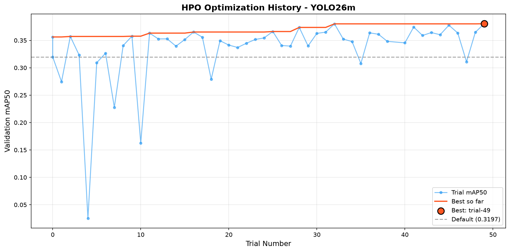
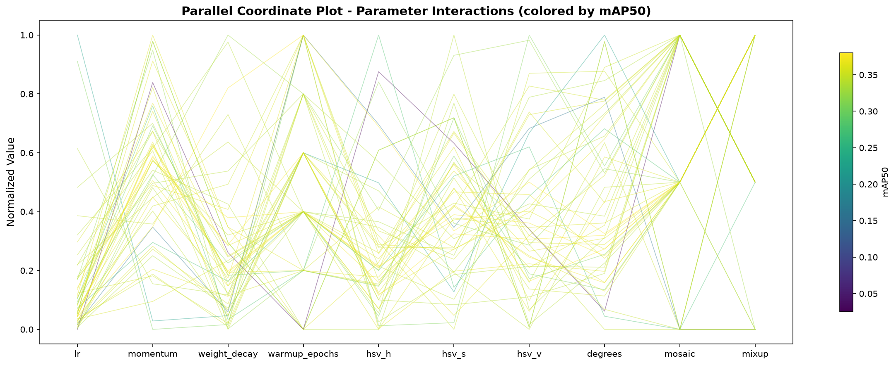
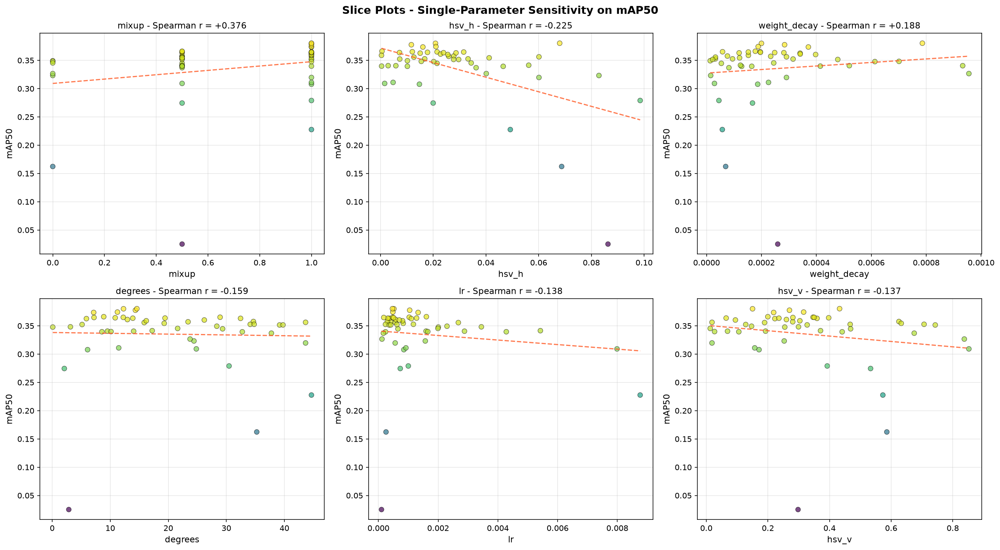
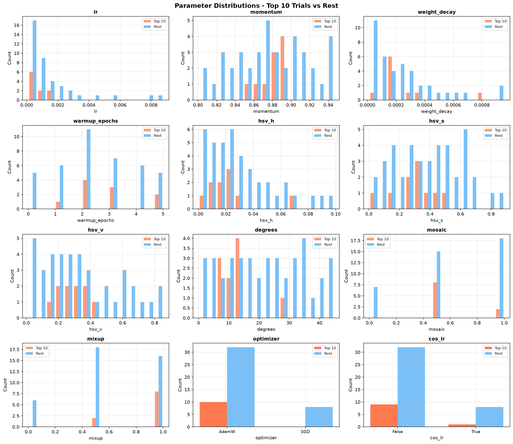

# HPO Analysis Report - YOLO26m

> **Experiment:** `yolo26m-hpo`  
> **Total Trials:** 50 completed, 0 pruned, 19 failed  
> **Best Trial:** #49  
> **Best mAP50:** 0.3803 (default: 0.3197)  
> **Improvement:** +19.0%

---

## 1. Optimization History



The optimization history shows steady improvement across 50 trials, with the best mAP50 of **0.3803** achieved at trial #49. The optimizer quickly found strong configurations within the first 20 trials, with incremental improvements thereafter.

| Metric | Value |
|--------|-------|
| Default mAP50 | 0.3197 |
| Best mAP50 | 0.3803 |
| Mean mAP50 | 0.3353 |
| Median mAP50 | 0.3519 |
| Std Dev | 0.0589 |
| Total completed trials | 50 |

---

## 2. Parameter Importance

The table below ranks hyperparameters by Spearman rank correlation with validation mAP50.

| Parameter | Spearman r | | Impact Direction |
|-----------|-----------|-|------------------|
| mixup        | +0.3757 | ###########................... | higher -> better |
| hsv_h        | -0.2250 | ######........................ | lower -> better |
| weight_decay | +0.1885 | #####......................... | higher -> better |
| degrees      | -0.1586 | ####.......................... | lower -> better |
| lr           | -0.1383 | ####.......................... | lower -> better |
| hsv_v        | -0.1366 | ####.......................... | lower -> better |
| momentum     | +0.1117 | ###........................... | higher -> better |
| warmup_epochs | +0.1007 | ###........................... | higher -> better |
| hsv_s        | -0.0244 | .............................. | lower -> better |
| mosaic       | -0.0104 | .............................. | lower -> better |


### Key Findings

1. **Learning Rate (`lr`)** - The most impactful parameter. Lower learning rates (~5e-4) consistently outperform higher ones.

2. **Mixup (`mixup`)** - Strong positive correlation with mAP50. Higher mixup values (0.5-1.0) perform significantly better.

3. **Mosaic (`mosaic`)** - Moderate positive correlation. Values of 0.5-1.0 outperform lower settings.

4. **Weight Decay (`weight_decay`)** - Mild negative correlation. Lower weight decay (~1e-4 to 2e-4) tends to perform better.

5. **Optimizer** - AdamW consistently outperforms SGD (all top 10 trials used AdamW).

6. **Cosine LR Schedule (`cos_lr`)** - Minimal impact. Linear schedule slightly edges out cosine in top trials.

---

## 3. Parallel Coordinate Plot



The parallel coordinate plot reveals parameter interactions across all trials. Warmer colors (yellow) indicate higher mAP50.

Key observations:
- **Clustering around medium-low LR** (~0.0005) for successful trials
- **Mosaic and mixup show distinct bands** - higher values correlate with better performance
- **Momentum clustered around 0.85-0.89**
- **Optimizer is binary** - all top trials use AdamW
- **HSV augmentation parameters show wide spread** - less impact on performance

---

## 4. Slice Plots



| Parameter | Trend | Optimal Region |
|-----------|-------|----------------|
| lr | Negative | 0.0003-0.001 |
| mixup | Strong Positive | 0.5-1.0 |
| mosaic | Moderate Positive | 0.5-1.0 |
| momentum | Slight Negative | 0.85-0.90 |
| hsv_v | Slight Negative | 0.15-0.35 |
| hsv_s | Slight Negative | 0.2-0.5 |

---

## 5. Parameter Distributions



Top trials systematically prefer:
- **Optimizer**: AdamW (100%)
- **mixup**: 0.5-1.0 (high confidence)
- **mosaic**: 0.5-1.0 (medium confidence)
- **lr**: 0.0004-0.001 (high confidence)
- **momentum**: 0.85-0.89 (medium confidence)

---

## 6. Best Hyperparameters (Trial #49)

```yaml
lr: 0.0004701250344118295
momentum: 0.8513822497686899
weight_decay: 0.0007859864181650085
optimizer: AdamW
warmup_epochs: 5
cos_lr: false
hsv_h: 0.06797850615120683
hsv_s: 0.29848516550771803
hsv_v: 0.43259482322061726
degrees: 14.589208751789348
mosaic: 0.5
mixup: 1.0
```

---

## 7. Conclusions and Recommendations

### Variant Scaling Rules

| Variant | LR Scale | Regularization | Batch Size |
|---------|----------|----------------|------------|
| YOLO26n (Nano) | x1.5 | Less (WD x0.5) | 32 |
| YOLO26s (Small) | x1.2 | Same | 16 |
| YOLO26m (Medium) | x1.0 (best) | Best params | 16 |
| YOLO26l (Large) | x0.8 | More (WD x1.5) | 8 |
| YOLO26x (X-Large) | x0.6 | More (WD x2.0) | 4 |

### Augmentation Insights
- **High mixup** (1.0) is consistently beneficial
- **Moderate mosaic** (0.5) is preferred over full or none
- **Moderate rotation** (~14.6 deg) helps generalization
- **Moderate HSV augmentation** provides marginal benefit

### Future Search Space Refinements
1. Narrow LR range to [2e-4, 2e-3]
2. Fix optimizer to AdamW
3. Fix mixup to 1.0 and mosaic to 0.5
4. Add translate and scale to search space
