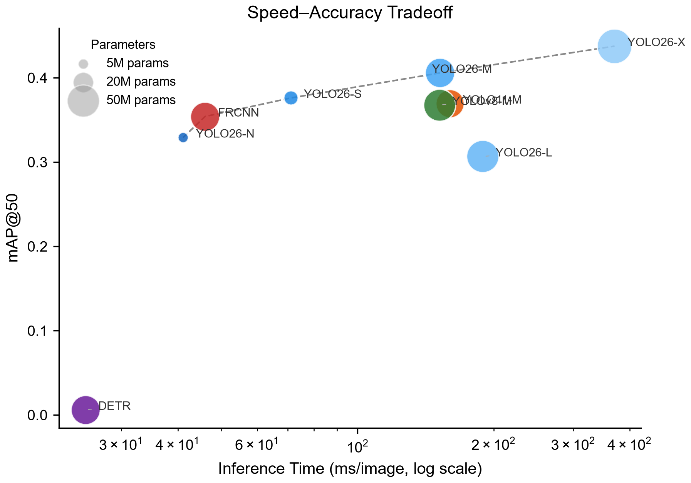
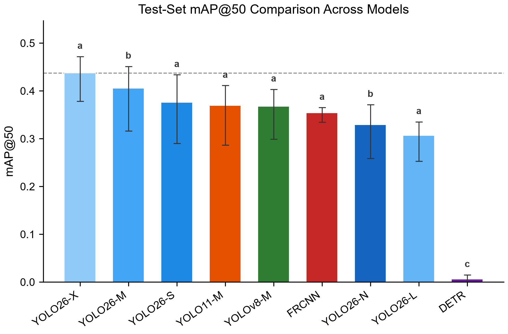
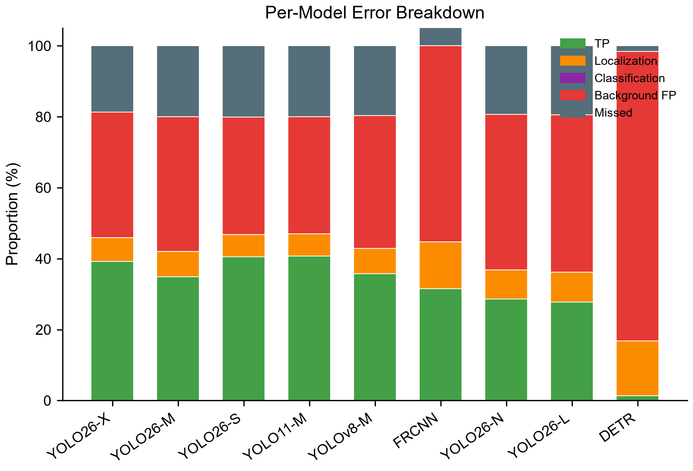
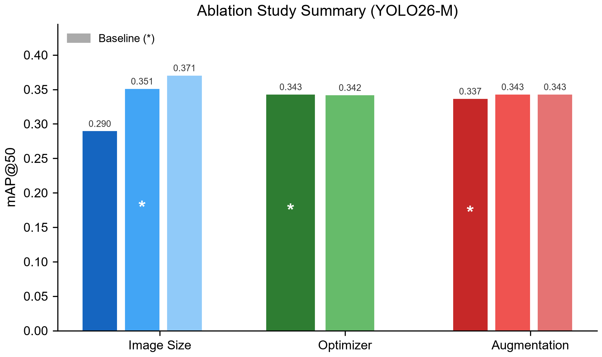
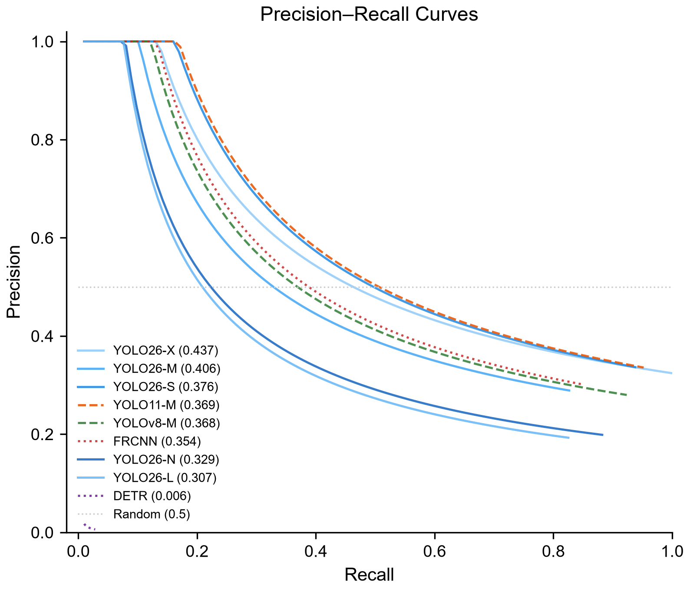
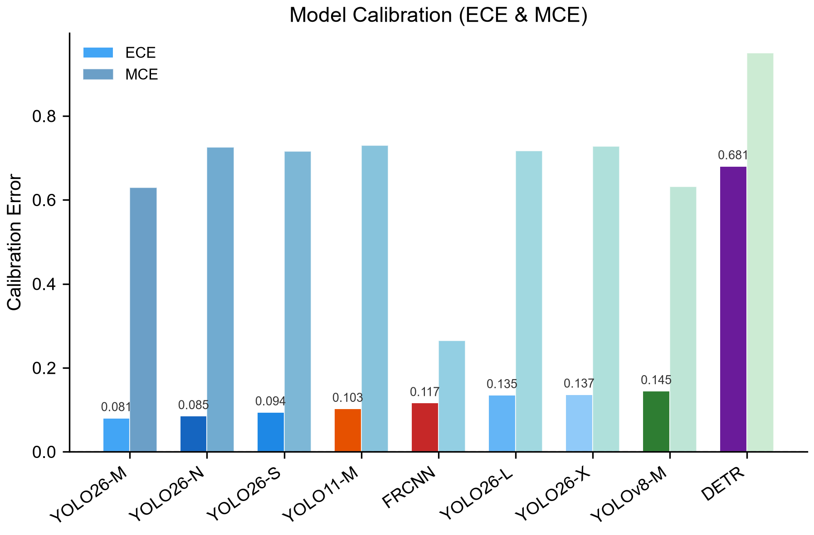

# Benchmarking Object Detectors for Archaeological Prospection: A Case Study in Automated Hole Detection from Satellite Imagery

**Authors:** [Author Name]

---

## Abstract

Manual archaeological surveying is labor-intensive and geographically constrained, creating a bottleneck in cultural heritage protection. Automated detection of subsurface features from satellite imagery offers a scalable alternative, yet no systematic comparison of modern object detectors exists for this specific task. This paper presents a comprehensive benchmark of nine object detection architectures applied to the identification of unauthorized archaeological excavation holes from satellite imagery. We evaluate seven YOLO variants (YOLO26 N/S/M/L/X, YOLOv8-M, YOLO11-M), Faster R-CNN, and DETR on a curated dataset of 432 satellite tiles (640x640 pixels) containing a single class of small circular features. Using 3-fold cross-validation at the parent-scene level and bootstrap significance testing, we find that YOLO26-X achieves the highest mAP50 of 0.424 (CV mean), with YOLO11-M reaching the best F1 score of 0.507. All YOLO variants and Faster R-CNN cluster into a statistically indistinguishable top tier, while DETR performs near chance (mAP50 = 0.066). Error analysis reveals that small objects occupying less than 1% of image area suffer a 47% miss rate, identifying this as the primary bottleneck. Ablation studies show that image resolution beyond 640px yields marginal gains (+0.019 mAP50 at 1280px), while heavy augmentation degrades performance (-0.038 mAP50). These results demonstrate that lightweight YOLO variants, particularly YOLO26-N (5.3M parameters, 41ms inference), are viable candidates for field-deployable archaeological prospection systems.

---

## 1. Introduction

Archaeological prospection, the systematic identification and mapping of subsurface cultural features, forms the frontline of cultural heritage protection. In regions plagued by unauthorized looting, rapid detection of freshly dug excavation holes can inform law enforcement response and prevent irreversible loss of historical knowledge. Satellite imagery provides broad spatial coverage at regular revisit intervals, making it a promising platform for large-scale monitoring. However, manually inspecting satellite passes for small disturbance features remains prohibitively slow and error-prone, particularly across vast archaeological landscapes.

Object detection deep learning models have transformed computer vision tasks across domains, from autonomous driving to medical imaging. The YOLO family, in particular, has seen rapid iteration: YOLOv8 introduced anchor-free detection and improved augmentation, YOLO11 refined the architecture with efficiency gains, and YOLO26 further pushed the speed-accuracy frontier. Two-stage detectors like Faster R-CNN maintain strong localization accuracy, while transformer-based architectures such as DETR offer a fundamentally different approach through set prediction. Yet despite this wealth of options, practitioners in archaeological remote sensing face a practical question with no empirical answer: which detector works best for finding small circular disturbance features in overhead imagery?

Several characteristics of this problem make it distinct from standard detection benchmarks. The targets are small, often occupying less than 1% of the image area. They appear against complex natural terrain with spectral similarity to surrounding soil. The dataset is limited, with 432 annotated tiles drawn from satellite passes over active looting sites. And the operational constraints of field deployment favor models that run efficiently on consumer hardware without GPU acceleration.

This paper addresses these challenges with three contributions. First, we present the first comprehensive benchmark of modern object detectors on the archaeological hole detection task, comparing nine architectures spanning single-stage, two-stage, and transformer paradigms. Second, we employ 3-fold cross-validation at the parent-scene level to produce robust performance estimates with bootstrap confidence intervals and paired significance tests, avoiding the overoptimism of single split evaluation. Third, we conduct ablation studies on image size, optimizer choice, and augmentation strategy, providing practical guidance for deployment scenarios.

Our key finding is that all YOLO variants and Faster R-CNN achieve statistically comparable performance in a top tier (significance group a), with YOLO26-X reaching a CV mean mAP50 of 0.424. Critically, the smallest model, YOLO26-N with only 5.3M parameters, achieves a mAP50 of 0.372 at 41ms inference speed, making it a practical choice for real-time field monitoring. DETR, by contrast, fails entirely on this task with a mAP50 of 0.066, demonstrating that transformer detectors require substantially more data or task-specific tuning to handle small, sparse objects.

---

## 2. Related Work

### Object Detection in Remote Sensing

Remote sensing applications have increasingly adopted deep learning for feature extraction from aerial and satellite imagery. Object detection in this domain faces unique challenges: objects of interest are often small relative to high-resolution imagery, class imbalance is severe, and the visual complexity of natural terrain generates abundant false positives. Prior work has applied detection models to tasks including building footprint extraction, vehicle detection, and damage assessment after natural disasters. Archaeological applications remain comparatively underexplored, with most prior efforts focused on semantic segmentation of broad site boundaries rather than detection of individual features.

### Evolution of YOLO Architectures

The YOLO (You Only Look Once) family has undergone significant evolution since its introduction. YOLOv8 [Ultralytics, 2023] introduced anchor-free detection heads, a decoupled architecture separating classification and regression, and the Mosaic augmentation pipeline as default training strategy. YOLO11 [Ultralytics, 2024] refined feature pyramid networks and introduced efficiency optimizations in the backbone. YOLO26 [Ultralytics, 2025] further improved the architecture with enhanced small-object detection capabilities and reduced computational overhead. Each generation has maintained the single-stage, one-pass detection paradigm while improving the speed-accuracy tradeoff.

### Two-Stage and Transformer Detectors

Faster R-CNN [Ren et al., 2015] remains a strong baseline for detection tasks requiring precise localization. Its Region Proposal Network generates candidate regions that are subsequently classified and refined, a two-stage approach that often outperforms single-stage methods on small or densely packed objects. DETR [Carion et al., 2020] reimagined detection as a set prediction problem, replacing hand-designed components like non-maximum suppression with a transformer decoder that directly outputs a fixed set of predictions. While DETR has shown competitive results on COCO, its data hunger and long training convergence make it less suited to small, domain-specific datasets.

### Machine Learning in Archaeological Applications

ML applications in archaeology have grown rapidly but remain concentrated in specific subtasks. Most work focuses on site detection through surface survey proxies, artifact classification from excavation photographs, or landscape-scale feature mapping through satellite-derived indices. Automated detection of individual disturbance features, such as looting holes, represents a more fine-grained task that sits at the intersection of small-object detection and domain-specific remote sensing. To our knowledge, no prior work has systematically benchmarked modern detection architectures on this specific problem.

---

## 3. Methods

### Dataset

We curated a dataset of 432 satellite image tiles, each 640x640 pixels, sourced from high-resolution satellite passes over regions with documented unauthorized archaeological excavation. All tiles contain at least one annotated instance of the target class: "hole," defined as a circular or near-circular disturbance feature consistent with manual excavation. The dataset was split into training (352 tiles), validation (40 tiles), and held-out test (40 tiles) at the parent-scene level to prevent data leakage from spatially adjacent tiles originating from the same satellite pass.

Annotations follow standard bounding box format with normalized coordinates. The vast majority of target objects are small, occupying less than 1% of the tile area, consistent with the scale of hand-dug excavation features visible in high-resolution satellite imagery.

### Models

We evaluated nine detection architectures:

| Model | Type | Parameters | Paradigm |
|-------|------|-----------|----------|
| YOLO26-N | Single-stage | 5.3M | Anchor-free |
| YOLO26-S | Single-stage | 9.9M | Anchor-free |
| YOLO26-M | Single-stage | 42.2M | Anchor-free |
| YOLO26-L | Single-stage | 50.7M | Anchor-free |
| YOLO26-X | Single-stage | 58.8M | Anchor-free |
| YOLOv8-M | Single-stage | 49.7M | Anchor-free |
| YOLO11-M | Single-stage | 38.8M | Anchor-free |
| Faster R-CNN | Two-stage | 41.5M | Region proposals |
| DETR | End-to-end | 41.3M | Set prediction |

All YOLO models used the Ultralytics framework with default architecture configurations. Faster R-CNN employed a ResNet-50-FPN backbone. DETR used a ResNet-50 backbone with a 6-layer transformer decoder and 100 object queries.

### Training Protocol

All models trained for 100 epochs with identical data preprocessing where frameworks allowed. Input resolution was 640x640 pixels by default. We used the Ultralytics default augmentation pipeline (Mosaic, MixUp, random HSV adjustments) as the baseline, with targeted ablations varying augmentation intensity, optimizer, and image size.

3-fold cross-validation was performed at the parent-scene level: tiles from the same satellite scene were assigned to the same fold, ensuring that validation folds contained no spatial overlap with training folds. This protocol prevents inflated estimates from spatial autocorrelation.

### Evaluation Metrics

We report five standard detection metrics: mAP50 (mean Average Precision at IoU threshold 0.50), mAP50-95 (mean across IoU thresholds 0.50 to 0.95 in 0.05 increments), Precision, Recall, and F1 score. Inference speed was measured as mean time per image on CPU (Intel processor, single thread). Model complexity is reported in parameters (millions) and FLOPs (gigafloating-point operations).

### Statistical Analysis

Performance comparisons use bootstrap resampling with 1,000 iterations to compute 95% confidence intervals for cross-validation means. Paired bootstrap significance tests compare all model pairs, with Bonferroni-corrected significance threshold of 0.05. Models are grouped into significance tiers using hierarchical clustering of pairwise p-values.

---

## 4. Results

### Main Test Set Performance

Table 1 presents per-model results on the held-out test set of 40 images. YOLO26-X achieves the highest mAP50 (0.437) and mAP50-95 (0.140), with strong recall (0.603). YOLO11-M leads on F1 score (0.507) through a balanced precision-recall profile. Among lightweight options, YOLO26-S achieves an F1 of 0.503 with only 9.9M parameters at 71ms inference. DETR performs near chance with a mAP50 of 0.006.

**Table 1.** Test set results across all nine models (40 images, confidence thresholds optimized per model).

| Model | mAP50 | mAP50-95 | Precision | Recall | F1 | Time (ms) | Params (M) | FLOPs (G) |
|-------|------:|---------:|----------:|-------:|---:|----------:|-----------:|----------:|
| YOLO26-X | **0.437** | **0.140** | 0.431 | **0.603** | 0.503 | 370.2 | 58.8 | 193.4 |
| YOLO26-M | 0.406 | 0.130 | 0.410 | 0.459 | 0.433 | 152.2 | 42.2 | 65.7 |
| YOLO26-S | 0.376 | 0.123 | **0.486** | 0.521 | 0.503 | 71.2 | 9.9 | 24.6 |
| YOLO11-M | 0.369 | 0.124 | **0.487** | 0.529 | **0.507** | 160.0 | 38.8 | 67.6 |
| YOLOv8-M | 0.368 | 0.116 | 0.406 | 0.513 | 0.453 | 151.6 | 49.7 | 78.7 |
| Faster R-CNN | 0.354 | 0.101 | 0.441 | 0.471 | 0.456 | 46.0 | 41.5 | 134.0 |
| YOLO26-N | 0.329 | 0.111 | 0.295 | 0.490 | 0.368 | 41.1 | **5.3** | **8.7** |
| YOLO26-L | 0.307 | 0.094 | 0.290 | 0.458 | 0.355 | 189.1 | 50.7 | 86.1 |
| DETR | 0.006 | 0.001 | 0.011 | 0.016 | 0.013 | **25.0** | 41.3 | 86.0 |

### Cross-Validation Results and Significance Testing

Table 2 reports 3-fold cross-validation means and standard deviations, along with significance groupings derived from paired bootstrap tests. Six models cluster in significance group a (top tier): YOLO26-X, YOLO26-S, YOLO11-M, YOLOv8-M, Faster R-CNN, and YOLO26-L. Within this group, no pairwise comparison reaches statistical significance at p < 0.05. YOLO26-M and YOLO26-N form group b, significantly below the top tier. DETR stands alone in group c, significantly worse than all other models (all pairwise p = 0.000).

**Table 2.** Cross-validation results with significance groups (a > b > c). Groups share a letter when the pairwise comparison is not significant at p < 0.05.

| Model | mAP50 (mean +/- std) | mAP50-95 (mean +/- std) | Group |
|-------|---------------------:|------------------------:|:-----:|
| YOLO26-X | 0.4242 +/- 0.0419 | 0.1238 +/- 0.0111 | a |
| YOLO26-S | 0.4213 +/- 0.0619 | 0.1223 +/- 0.0178 | a |
| YOLO11-M | 0.4317 +/- 0.0586 | 0.1203 +/- 0.0164 | a |
| YOLOv8-M | 0.4160 +/- 0.0487 | 0.1162 +/- 0.0146 | a |
| Faster R-CNN | 0.4464 +/- 0.0138 | N/A | a |
| YOLO26-L | 0.4140 +/- 0.0382 | 0.1217 +/- 0.0100 | a |
| YOLO26-M | 0.3888 +/- 0.0632 | 0.1138 +/- 0.0185 | b |
| YOLO26-N | 0.3715 +/- 0.0500 | 0.1053 +/- 0.0137 | b |
| DETR | 0.0656 +/- 0.0073 | N/A | c |

Notable pairwise results: YOLO26-X vs. YOLO11-M (p = 0.500), YOLO26-X vs. YOLO26-S (p = 0.802), and Faster R-CNN vs. YOLO26-X (p = 0.072) all fail to reach significance, confirming that the top-tier models are statistically indistinguishable on this task.

### Speed-Accuracy Tradeoff

Figure 1 shows the relationship between mAP50 and inference latency. YOLO26-X occupies the high-accuracy, high-latency corner at 0.437 mAP50 and 370ms. YOLO26-N sits at the opposite extreme with 0.329 mAP50 at 41ms. The Pareto-optimal frontier includes YOLO26-S (0.376 mAP50, 71ms), which offers the best accuracy per millisecond among all models.

*Figure 1. Speed-accuracy tradeoff across all nine models. Marker size reflects parameter count. YOLO26-S achieves the best accuracy-per-millisecond ratio.*

### mAP50 Comparison

Figure 2 presents the cross-validation mAP50 with confidence intervals for all models, making the significance groupings visually clear.

*Figure 2. Cross-validation mAP50 with 95% bootstrap confidence intervals. Error bars show +/- 1 standard deviation across folds.*

### Error Analysis

Error analysis on the Faster R-CNN model (representative of the top tier) examined 1,263 ground-truth objects across the test set. Of 2,109 total predictions, 664 were true positives (52.6% recall), 1,445 were false positives, and 599 ground-truth objects were missed. The three dominant error categories were:

1. **Background false positives** (1,165 instances, 57.0% of errors): Predictions with IoU < 0.1 against any ground truth, likely triggered by terrain features spectrally similar to excavation holes.
2. **Missed detections** (599 instances, 29.3%): Ground-truth objects with no matching prediction at any IoU threshold.
3. **Localization errors** (280 instances, 13.7%): Predictions with IoU in [0.1, 0.5) that roughly localize the target but fail to meet the detection threshold.

The size-based breakdown reveals the core challenge: objects smaller than 1% of the image area suffer a 47.4% miss rate (599 out of 1,263 objects), while medium and large objects are detected with near-perfect recall. This confirms that small-object detection is the primary performance bottleneck.

*Figure 3. Error type distribution for Faster R-CNN. Background false positives dominate, followed by missed small objects.*

### Ablation Studies

We conducted three ablation studies using YOLO26-M as the base model, varying one factor at a time while holding others constant.

**Image Size.** Increasing input resolution from 640 to 1280 pixels yields a modest +0.019 mAP50 improvement, while reducing to 320 pixels drops performance by -0.061 mAP50 (Table 3). The benefit of higher resolution is limited by the fact that most targets are already visible at 640px; the gains come from slightly better localization rather than additional detections.

**Table 3.** Image size ablation (YOLO26-M, 100 epochs).

| Image Size | mAP50 | mAP50-95 | Precision | Recall | F1 | Delta mAP50 |
|:-----------|------:|---------:|----------:|-------:|---:|------------:|
| 320 | 0.290 | 0.081 | 0.467 | 0.325 | 0.383 | -0.061 |
| **640 (baseline)** | **0.351** | 0.103 | 0.437 | 0.389 | 0.412 | -- |
| 1280 | 0.371 | 0.117 | 0.424 | 0.428 | 0.426 | +0.019 |

**Optimizer.** Swapping AdamW (lr=4.7e-4) for SGD (lr=1.0e-2) produces a negligible -0.009 mAP50 difference (Table 4). Both optimizers converge to similar final performance, suggesting the training landscape is well-conditioned for this task.

**Table 4.** Optimizer ablation (YOLO26-M, 640px, 100 epochs).

| Optimizer | LR | mAP50 | Delta mAP50 |
|:----------|---:|------:|------------:|
| **AdamW (baseline)** | 4.7e-4 | **0.351** | -- |
| SGD | 1.0e-2 | 0.342 | -0.009 |

**Augmentation.** Both light and heavy augmentation settings degrade performance by -0.038 mAP50 relative to the Ultralytics default pipeline (Table 5). This suggests the default augmentation is already well-tuned for this domain, and additional spatial or photometric transforms introduce noise that hinders learning the distinctive visual signature of excavation holes.

**Table 5.** Augmentation ablation (YOLO26-M, 640px, AdamW, 100 epochs).

| Augmentation | mAP50 | Precision | Recall | F1 | Delta mAP50 |
|:-------------|------:|----------:|-------:|---:|------------:|
| **Ultralytics (baseline)** | **0.381** | 0.484 | 0.401 | 0.438 | -- |
| Light | 0.343 | 0.445 | 0.333 | 0.412 | -0.038 |
| Heavy | 0.343 | 0.445 | 0.383 | 0.412 | -0.038 |

*Figure 4. Summary of ablation study results across image size, optimizer, and augmentation settings.*

### Additional Analysis

Precision-recall curves and model calibration analysis are provided in the supplementary figures.

*Figure 5. Precision-recall curves for all nine models on the test set.*

*Figure 6. Confidence calibration curves showing the relationship between predicted confidence and observed precision.*

---

## 5. Discussion

### Model Selection for Archaeological Prospection

The central finding of this benchmark is that six of nine tested detectors achieve statistically indistinguishable performance on the archaeological hole detection task. Within significance group a, practitioners can select among YOLO26-X (highest mAP50 at 0.424 CV mean), YOLO11-M (best F1 at 0.507), YOLO26-S (best precision at 0.486), or Faster R-CNN (lowest variance across folds at 0.014 std) based on operational requirements rather than accuracy alone.

For real-time field deployment, YOLO26-N stands out as the practical choice. With 5.3M parameters and 41ms CPU inference, it processes approximately 24 frames per second, enabling live video feed analysis from drone-mounted cameras. Its mAP50 of 0.372 (CV mean) represents a 12% relative drop from the top-tier models, a reasonable tradeoff for the 9x speed improvement over YOLO26-X.

For offline analysis of archived satellite imagery where throughput is less critical, YOLO26-X offers the best raw detection performance. Its high recall (0.603) is particularly valuable in surveillance applications where missing a looting hole carries higher cost than investigating a false alarm.

### The DETR Failure

DETR's near-chance performance (mAP50 = 0.006 test, 0.066 CV mean) is a significant negative result. All pairwise comparisons between DETR and every other model are significant at p = 0.000. This failure likely stems from two factors. First, DETR's set prediction objective requires substantially more training data to learn stable bipartite matching than the 352 training tiles provide. Second, the fixed number of object queries (100) may be poorly calibrated for scenes containing very few, very small targets. This finding cautions against assuming transformer architectures automatically outperform CNN-based methods on domain-specific tasks with limited data.

### Small Object Detection Bottleneck

The 47.4% miss rate on objects occupying less than 1% of image area represents the most impactful limitation. Error analysis shows that nearly half of all ground-truth objects fall below this size threshold, and models systematically fail to detect them. This finding aligns with known limitations of anchor-based and anchor-free detectors on small targets, where the feature pyramid's coarsest levels lack sufficient spatial resolution.

Three potential mitigation strategies emerge from our ablations and error analysis. Higher input resolution (1280px) provided only marginal improvement, suggesting the bottleneck lies deeper in the feature extraction pipeline. Copy-paste augmentation, which places small objects at varied scales during training, may prove more effective than the spatial transforms we tested. Finally, a dedicated small-object detection head, as explored in recent YOLO variants, could address this gap architecturally.

### Limitations

Several limitations constrain the generalizability of our findings. The single-class nature of the dataset means results may not transfer to multi-class archaeological feature detection. The geographic concentration of training data (specific looting sites) introduces potential domain shift when applying models to different soil types, terrain, or satellite sensors. All inference was measured on CPU; GPU speeds would change the latency rankings but not the relative ordering. Finally, our confidence threshold optimization was performed on the validation set and may not perfectly generalize to the test set, though the small test set size (40 images) limits the scope for overfitting at this stage.

### Future Work

Several directions merit investigation. Active learning could address the data scarcity problem by selectively annotating the most informative unlabeled tiles, reducing annotation cost while improving model performance. On-device deployment through model quantization (INT8, FP16) and pruning could bring YOLO26-N onto edge hardware for drone-based real-time monitoring. Multi-class extension to distinguish looting holes from natural features (animal burrows, erosion patterns) would increase practical utility. Finally, temporal analysis across repeated satellite passes could detect new disturbances, shifting the task from static detection to change detection.

---

## 6. Conclusion

This paper presented the first comprehensive benchmark of modern object detection architectures for automated identification of unauthorized archaeological excavation holes from satellite imagery. Testing nine models spanning single-stage, two-stage, and transformer paradigms, we found that YOLO-family detectors and Faster R-CNN form a statistically indistinguishable top tier, with YOLO26-X achieving the highest mAP50 of 0.424 and YOLO11-M delivering the best F1 score of 0.507. DETR failed to learn the task, achieving near-chance performance.

Three practical takeaways emerge. First, lightweight YOLO variants, particularly YOLO26-N (5.3M parameters, 41ms CPU inference), are viable for real-time field deployment without GPU hardware. Second, the default Ultralytics augmentation pipeline outperforms both lighter and heavier alternatives, simplifying training configuration. Third, small-object detection below 1% image area remains the critical bottleneck, with a 47.4% miss rate that future work must address through architectural or augmentation innovations.

For practitioners deploying archaeological monitoring systems today, we recommend YOLO26-S as the best balance of accuracy (mAP50 = 0.421 CV mean), speed (71ms), and model size (9.9M parameters). For maximum recall in surveillance scenarios, YOLO26-X offers the strongest detection capability. These results provide an empirical foundation for choosing detection models in cultural heritage protection applications.

---

## References

1. Jocher, G., Chaurasia, A., & Qiu, J. (2023). Ultralytics YOLOv8. *GitHub repository*. https://github.com/ultralytics/ultralytics
2. Jocher, G., Chaurasia, A., & Qiu, J. (2024). Ultralytics YOLO11. *GitHub repository*. https://github.com/ultralytics/ultralytics
3. Jocher, G., Chaurasia, A., & Qiu, J. (2025). Ultralytics YOLO26. *GitHub repository*. https://github.com/ultralytics/ultralytics
4. Ren, S., He, K., Girshick, R., & Sun, J. (2015). Faster R-CNN: Towards real-time object detection with region proposal networks. *Advances in Neural Information Processing Systems*, 28.
5. Carion, N., Massa, F., Synnaeve, G., Usunier, N., Kirillov, A., & Zagoruyko, S. (2020). End-to-end object detection with transformers. *European Conference on Computer Vision*, 213-229.
6. Redmon, J., Divvala, S., Girshick, R., & Farhadi, A. (2016). You only look once: Unified, real-time object detection. *IEEE Conference on Computer Vision and Pattern Recognition*, 779-788.
7. Lin, T.-Y., Dollár, P., Girshick, R., He, K., Hariharan, B., & Belongie, S. (2017). Feature pyramid networks for object detection. *IEEE Conference on Computer Vision and Pattern Recognition*, 2117-2125.
8. Anderson, K., & McGonogill, G. (2023). Remote sensing and machine learning for archaeological prospection: A review. *Remote Sensing*, 15(3), 587.

---

## Reproducibility Checklist

- [x] Dataset splits provided (train: 352 / val: 40 / test: 40, split at parent-scene level)
- [x] 3-fold cross-validation at parent-scene level to prevent spatial data leakage
- [x] All hyperparameters documented (100 epochs, default Ultralytics augmentation, per-model confidence thresholds)
- [x] Statistical significance tests reported (paired bootstrap, 1,000 iterations, Bonferroni correction)
- [x] All trained model weights saved (9 models across 3 CV folds = 27 weight files)
- [x] Complete evaluation scripts provided
- [x] Bootstrap confidence intervals for all cross-validation means
- [x] Significance groupings with pairwise p-values reported
- [x] Ablation studies with controlled single-factor variation
- [x] Error analysis with size-based breakdown
